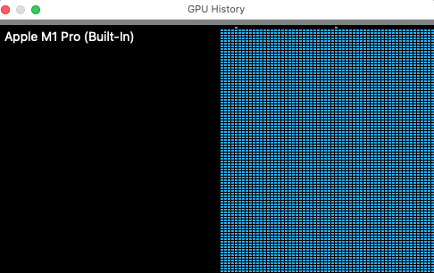

# Physical AI Hackathon Learnings

A personal log of learnings, experiments, and notes from the Physical AI hackathon.

---

## Table of Contents

- [Physical AI Hackathon Learnings](#physical-ai-hackathon-learnings)
  - [Table of Contents](#table-of-contents)
  - [Overview](#overview)
  - [Training on collected data](#training-on-collected-data)
  - [Learnings](#learnings)
    - [Key Takeaways](#key-takeaways)
    - [Concepts Explored](#concepts-explored)
  - [Projects \& Experiments](#projects--experiments)
    - [Experiment 1: ](#experiment-1-)
  - [Tools \& Tech Stack](#tools--tech-stack)
  - [Challenges](#challenges)
  - [Resources](#resources)
  - [Notes](#notes)

---

## Overview

This hackathon provided us following things
1. xlerobot arms ( Leader and Follower )
2. [open source app Makermods-app](https://github.com/Maker-Mods/MakerMods-App)
   - This App can take care
      - Imitation learning
        - Leader Arm + Follower Arm 
      - Data collection
        - Collects servo motor angles + video feed 
      - Upload the dataset to [hugging face dataset](https://huggingface.co/datasets/knatarasan/makermods_pick_dishes_and_stack_2/tree/main)
      - Train the data and upload [model to hugging face](https://huggingface.co/knatarasan/act_pick_dishes_and_stack_checkpoint_20k/tree/main)
      - Run inference

---

## Training on collected data 

Run this after uploading data into huggingface

```
lerobot-train \
--dataset.repo_id=knatarasan/makermods_pick_dishes_and_stack_2 \
--dataset.revision=main \
--policy.type=act \
--policy.device=mps \
--output_dir=outputs/train/act_makermods_pick_dishes_and_stack_2 \
--job_name=act_makermods_pick_dishes_and_stack_2 \
--policy.repo_id=knatarasan/act_makermods_pick_dishes_and_stack_22
```

Typical run would be like the following

```
((.venv) ) kannappannatarasan@kanna-mac physical-ai-hackathon % lerobot-train \
--dataset.repo_id=knatarasan/makermods_pick_dishes_and_stack_2 \
--dataset.revision=main \
--policy.type=act \
--policy.device=mps \
--output_dir=outputs/train/act_makermods_pick_dishes_and_stack_2 \
--job_name=act_makermods_pick_dishes_and_stack_2 \
--policy.repo_id=knatarasan/act_makermods_pick_dishes_and_stack_22
INFO 2026-05-28 16:43:07 ot_train.py:197 {'batch_size': 8,
 'checkpoint_path': None,
 'cudnn_deterministic': False,
 'dataset': {'episodes': None,
             'image_transforms': {'enable': False,
                                  'max_num_transforms': 3,
                                  'random_order': False,
                                  'tfs': {'affine': {'kwargs': {'degrees': [-5.0,
                                                                            5.0],
                                                                'translate': [0.05,
                                                                              0.05]},
                                                     'type': 'RandomAffine',
                                                     'weight': 1.0},
                                          'brightness': {'kwargs': {'brightness': [0.8,
                                                                                   1.2]},
                                                         'type': 'ColorJitter',
                                                         'weight': 1.0},
                                          'contrast': {'kwargs': {'contrast': [0.8,
                                                                               1.2]},
                                                       'type': 'ColorJitter',
                                                       'weight': 1.0},
                                          'hue': {'kwargs': {'hue': [-0.05,
                                                                     0.05]},
                                                  'type': 'ColorJitter',
                                                  'weight': 1.0},
                                          'saturation': {'kwargs': {'saturation': [0.5,
                                                                                   1.5]},
                                                         'type': 'ColorJitter',
                                                         'weight': 1.0},
                                          'sharpness': {'kwargs': {'sharpness': [0.5,
                                                                                 1.5]},
                                                        'type': 'SharpnessJitter',
                                                        'weight': 1.0}}},
             'repo_id': 'knatarasan/makermods_pick_dishes_and_stack_2',
             'revision': 'main',
             'root': None,
             'streaming': False,
             'use_imagenet_stats': True,
             'video_backend': 'torchcodec'},
 'env': None,
 'eval': {'batch_size': 50, 'n_episodes': 50, 'use_async_envs': False},
 'eval_freq': 20000,
 'job_name': 'act_makermods_pick_dishes_and_stack_2',
 'log_freq': 200,
 'num_workers': 4,
 'optimizer': {'betas': [0.9, 0.999],
               'eps': 1e-08,
               'grad_clip_norm': 10.0,
               'lr': 1e-05,
               'type': 'adamw',
               'weight_decay': 0.0001},
 'output_dir': 'outputs/train/act_makermods_pick_dishes_and_stack_2',
 'peft': None,
 'policy': {'chunk_size': 100,
            'device': 'mps',
            'dim_feedforward': 3200,
            'dim_model': 512,
            'dropout': 0.1,
            'feedforward_activation': 'relu',
            'input_features': {},
            'kl_weight': 10.0,
            'latent_dim': 32,
            'license': None,
            'n_action_steps': 100,
            'n_decoder_layers': 1,
            'n_encoder_layers': 4,
            'n_heads': 8,
            'n_obs_steps': 1,
            'n_vae_encoder_layers': 4,
            'normalization_mapping': {'ACTION': <NormalizationMode.MEAN_STD: 'MEAN_STD'>,
                                      'STATE': <NormalizationMode.MEAN_STD: 'MEAN_STD'>,
                                      'VISUAL': <NormalizationMode.MEAN_STD: 'MEAN_STD'>},
            'optimizer_lr': 1e-05,
            'optimizer_lr_backbone': 1e-05,
            'optimizer_weight_decay': 0.0001,
            'output_features': {},
            'pre_norm': False,
            'pretrained_backbone_weights': 'ResNet18_Weights.IMAGENET1K_V1',
            'pretrained_path': None,
            'private': None,
            'push_to_hub': True,
            'replace_final_stride_with_dilation': False,
            'repo_id': 'knatarasan/act_makermods_pick_dishes_and_stack_22',
            'tags': None,
            'temporal_ensemble_coeff': None,
            'type': 'act',
            'use_amp': False,
            'use_peft': False,
            'use_vae': True,
            'vision_backbone': 'resnet18'},
 'rabc_epsilon': 1e-06,
 'rabc_head_mode': 'sparse',
 'rabc_kappa': 0.01,
 'rabc_progress_path': None,
 'rename_map': {},
 'resume': False,
 'save_checkpoint': True,
 'save_freq': 20000,
 'scheduler': None,
 'seed': 1000,
 'steps': 100000,
 'tolerance_s': 0.0001,
 'use_policy_training_preset': True,
 'use_rabc': False,
 'wandb': {'add_tags': True,
           'disable_artifact': False,
           'enable': False,
           'entity': None,
           'mode': None,
           'notes': None,
           'project': 'lerobot',
           'run_id': None}}
INFO 2026-05-28 16:43:07 ot_train.py:205 Logs will be saved locally.
INFO 2026-05-28 16:43:07 ot_train.py:221 Creating dataset
Fetching 4 files: 100%|█████████████████████████████████████████████████████████████████████████████████████████████████████████████████████████████████████████████████████████████████████| 4/4 [00:02<00:00,  1.65it/s]
Download complete: 100%|█████████████████████████████████████████████████████████████████████████████████████████████████████████████████████████████████████████████████████████████| 75.1k/75.1k [00:02<00:00, 4.82kB/s]INFO 2026-05-28 16:43:11 eo_utils.py:108 Using video codec: libsvtav1
Fetching 4 files: 100%|██████████████████████████████████████████████████████████████████████████████████████████████████████████████████████████████████████████████████████████████████| 4/4 [00:00<00:00, 12381.71it/s]
Download complete: : 0.00B [00:00, ?B/s] [00:00, ?B/s]
Download complete: 100%|█████████████████████████████████████████████████████████████████████████████████████████████████████████████████████████████████████████████████████████████| 75.1k/75.1k [00:03<00:00, 22.8kB/s]
Fetching 12 files: 100%|██████████████████████████████████████████████████████████████████████████████████████████████████████████████████████████████████████████████████████████████████| 12/12 [00:18<00:00,  1.56s/it]
Download complete: 100%|███████████████████████████████████████████████████████████████████████████████████████████████████████████████████████████████████████████████████████████████| 123M/123M [00:18<00:00, 6.94MB/s]INFO 2026-05-28 16:43:31 ot_train.py:239 Creating policy
INFO 2026-05-28 16:43:31 ot_train.py:306 Creating optimizer and scheduler
INFO 2026-05-28 16:43:31 ot_train.py:341 Output dir: outputs/train/act_makermods_pick_dishes_and_stack_2
INFO 2026-05-28 16:43:31 ot_train.py:348 cfg.steps=100000 (100K)
INFO 2026-05-28 16:43:31 ot_train.py:349 dataset.num_frames=29997 (30K)
INFO 2026-05-28 16:43:31 ot_train.py:350 dataset.num_episodes=50
INFO 2026-05-28 16:43:31 ot_train.py:353 Effective batch size: 8 x 1 = 8
INFO 2026-05-28 16:43:31 ot_train.py:354 num_learnable_params=51597190 (52M)
INFO 2026-05-28 16:43:31 ot_train.py:355 num_total_params=51597190 (52M)
Training:   0%|                                                                                                                                                                              | 0/100000 [00:00<?, ?step/s]INFO 2026-05-28 16:43:31 ot_train.py:419 Start offline training on a fixed dataset, with effective batch size: 8
objc[92868]: Class AVFFrameReceiver is implemented in both /Users/kannappannatarasan/workspace/practice/physical-ai-maker-mods/physical-ai-hackathon/.venv/lib/python3.12/site-packages/av/.dylibs/libavdevice.61.3.100.dylib (0x116c143a8) and /opt/homebrew/Cellar/ffmpeg/8.1.1/lib/libavdevice.62.3.101.dylib (0x131710328). This may cause spurious casting failures and mysterious crashes. One of the duplicates must be removed or renamed.
objc[92876]: Class AVFFrameReceiver is implemented in both /Users/kannappannatarasan/workspace/practice/physical-ai-maker-mods/physical-ai-hackathon/.venv/lib/python3.12/site-packages/av/.dylibs/libavdevice.61.3.100.dylib (0x114a4c3a8) and /opt/homebrew/Cellar/ffmpeg/8.1.1/lib/libavdevice.62.3.101.dylib (0x12f6e4328). This may cause spurious casting failures and mysterious crashes. One of the duplicates must be removed or renamed.
objc[92870]: Class AVFFrameReceiver is implemented in both /Users/kannappannatarasan/workspace/practice/physical-ai-maker-mods/physical-ai-hackathon/.venv/lib/python3.12/site-packages/av/.dylibs/libavdevice.61.3.100.dylib (0x111f383a8) and /opt/homebrew/Cellar/ffmpeg/8.1.1/lib/libavdevice.62.3.101.dylib (0x12ca10328). This may cause spurious casting failures and mysterious crashes. One of the duplicates must be removed or renamed.
objc[92868]: Class AVFAudioReceiver is implemented in both /Users/kannappannatarasan/workspace/practice/physical-ai-maker-mods/physical-ai-hackathon/.venv/lib/python3.12/site-packages/av/.dylibs/libavdevice.61.3.100.dylib (0x116c143f8) and /opt/homebrew/Cellar/ffmpeg/8.1.1/lib/libavdevice.62.3.101.dylib (0x131710378). This may cause spurious casting failures and mysterious crashes. One of the duplicates must be removed or renamed.
objc[92876]: Class AVFAudioReceiver is implemented in both /Users/kannappannatarasan/workspace/practice/physical-ai-maker-mods/physical-ai-hackathon/.venv/lib/python3.12/site-packages/av/.dylibs/libavdevice.61.3.100.dylib (0x114a4c3f8) and /opt/homebrew/Cellar/ffmpeg/8.1.1/lib/libavdevice.62.3.101.dylib (0x12f6e4378). This may cause spurious casting failures and mysterious crashes. One of the duplicates must be removed or renamed.
objc[92870]: Class AVFAudioReceiver is implemented in both /Users/kannappannatarasan/workspace/practice/physical-ai-maker-mods/physical-ai-hackathon/.venv/lib/python3.12/site-packages/av/.dylibs/libavdevice.61.3.100.dylib (0x111f383f8) and /opt/homebrew/Cellar/ffmpeg/8.1.1/lib/libavdevice.62.3.101.dylib (0x12ca10378). This may cause spurious casting failures and mysterious crashes. One of the duplicates must be removed or renamed.
objc[92869]: Class AVFFrameReceiver is implemented in both /Users/kannappannatarasan/workspace/practice/physical-ai-maker-mods/physical-ai-hackathon/.venv/lib/python3.12/site-packages/av/.dylibs/libavdevice.61.3.100.dylib (0x115f783a8) and /opt/homebrew/Cellar/ffmpeg/8.1.1/lib/libavdevice.62.3.101.dylib (0x130dd0328). This may cause spurious casting failures and mysterious crashes. One of the duplicates must be removed or renamed.
objc[92869]: Class AVFAudioReceiver is implemented in both /Users/kannappannatarasan/workspace/practice/physical-ai-maker-mods/physical-ai-hackathon/.venv/lib/python3.12/site-packages/av/.dylibs/libavdevice.61.3.100.dylib (0x115f783f8) and /opt/homebrew/Cellar/ffmpeg/8.1.1/lib/libavdevice.62.3.101.dylib (0x130dd0378). This may cause spurious casting failures and mysterious crashes. One of the duplicates must be removed or renamed.
Download complete: 100%|███████████████████████████████████████████████████████████████████████████████████████████████████████████████████████████████████████████████████████████████| 123M/123M [00:38<00:00, 3.22MB/s]
Training:   0%|▎                                                                                                                                                                | 200/100000 [02:04<14:26:28,  1.92step/s]INFO 2026-05-28 16:45:36 ot_train.py:451 step:200 smpl:2K ep:3 epch:0.05 loss:6.911 grdn:154.730 lr:1.0e-05 updt_s:0.578 data_s:0.045
Training:   0%|▍                                                                                                                                                                | 280/100000 [02:45<14:28Training:   0%|▍                                                                                                                                                                | 281/100000 [02:46<14:28:47,  Training:   0%|▍                                                                                                                                                                | 282/100000 [02:47<14:28:38,  Training:   0%|▍                                                                                                                                                                | 283/100000 [02:47<14:25:36,  Training:   0%|▍                                                                                                                                                                | 284/100000 [02:48<14:21:19,  Training:   0%|▍                                                                                                                                                                | 285/100000 [02:48<14:20:31,  Training:   0%|▍                                                                                                                                                                | 286/100000 [02:49<14:19:19,  Training:   0%|▍                                                                                                                                                                | 287/100000 [02:49<14:17:53,  Training:   0%|▍                                                                                                                                                                | 288/100000 [02:50<14:16:16,  Training:   0%|▍                                                                                                                                                                | 289/100000 [02:50<14:18:28,  Training:   0%|▍                                                                                                                                                                | 290/100000 [02:51<14:17:54,  Training:   0%|▍                                                                                                                                                                | 291/100000 [02:51<14:17:29,  Training:   0%|▍                                                                                                                                                                | 292/100000 [02:52<14:16:21,  Training:   0%|▍                                                                                                                                                                | 293/100000 [02:52<14:16:02,  Training:   0%|▍                                                                                                                                                                | 294/100000 [02:53<14:16:22,  Training:   0%|▍                                                                                                                                                                | 295/100000 [02:53<14:14:23,  Training:   0%|▍                                                                                                                                                                | 296/100000 [02:54<14:14:20,  Training:   0%|▍                                                                                                                                                                | 297/100000 [02:54<14:14:27,  Training:   0%|▍                                                                                                                                                                | 298/100000 [02:55<14:12:30,  Training:   0%|▍                                                                                                                                                                | 299/100000 [02:55<14:13:05,  Training:   0%|▍                                                                                                                                                                | 300/100000 [02:56<14:13:43,  Training:   0%|▍                                                                                                                                                                | 301/100000 [02:56<14:14:03,  Training:   0%|▍                                                                                                                                                                | 302/100000 [02:57<14:14:15,  Training:   0%|▍                                                                                                                                                                | 303/100000 [02:57<14:16:57,  Training:   0%|▍                                                                                                                                                                | 304/100000 [02:58<14:17:59,  Training:   0%|▍                                                                                                                                                                | 305/100000 [02:58<14:17:42,  Training:   0%|▍                                                                                                                                                                | 306/100000 [02:59<14:14:27,  Training:   0%|▍                                                                                                                                                                | 307/100000 [02:59<14:12:58,  Training:   0%|▍                                                                                                                                                                | 308/100000 [03:00<14:12:13,  Training:   0%|▍                                                                                                                                                                | 309/100000 [03:00<14:14:21,  Training:   0%|▍                                                                                                                                                                | 310/100000 [03:01<14:15:47,  Training:   0%|▌                                                                                                                                                                | 311/100000 [03:01<14:13:58,  Training:   0%|▌                                                                                                                                                                | 312/100000 [03:02<14:15:10,  Training:   0%|▌                                                                                                                                                                | 313/100000 [03:02<14:17:20,  Training:   0%|▋                                                                                                                                                                | 400/100000 [03:48<14:11:54,  1.95step/s]INFO 2026-05-28 16:47:19 ot_train.py:451 step:400 smpl:3K ep:5 epch:0.11 loss:3.047 grdn:84.895 lr:1.0e-05 updt_s:0.506 data_s:0.010
Training:   1%|▉                                                                                                                                                                | 600/100000 [05:31<14:17:53,  1.93step/s]INFO 2026-05-28 16:49:03 ot_train.py:451 step:600 smpl:5K ep:8 epch:0.16 loss:2.557 grdn:75.582 lr:1.0e-05 updt_s:0.508 data_s:0.010
Training:   1%|▉                                                                                                                                                                | 609/100000 [05:36<14:10:44,  1.95step/s]
```

This is running on mps architecture ( mac hardware) on local GPU


## Learnings

### Key Takeaways
 - How feasible to run end end to imitation learning and Simplicity in  using  xlerobot hardware
 - power of maker-mods app

### Concepts Explored

 - Imitation learning

---

## Projects & Experiments

### Experiment 1: <!-- Title -->

**Goal:**

**Approach:**

**Result:**

**What I learned:**

---

## Tools & Tech Stack

| Tool / Library | Purpose | Notes |
| -------------- | ------- | ----- |
|                |         |       |

---

## Challenges 
Initial training brought very weak inference
## Resources

<!-- Papers, videos, repos, docs that were helpful -->

---

## Notes

<!-- Anything else worth remembering -->

